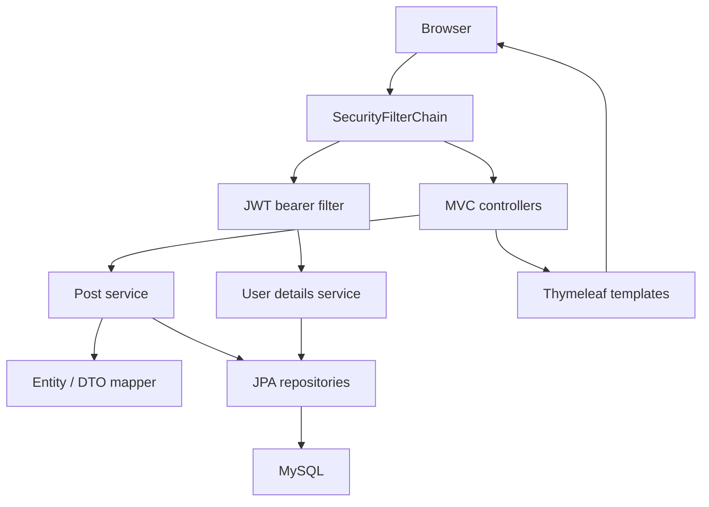
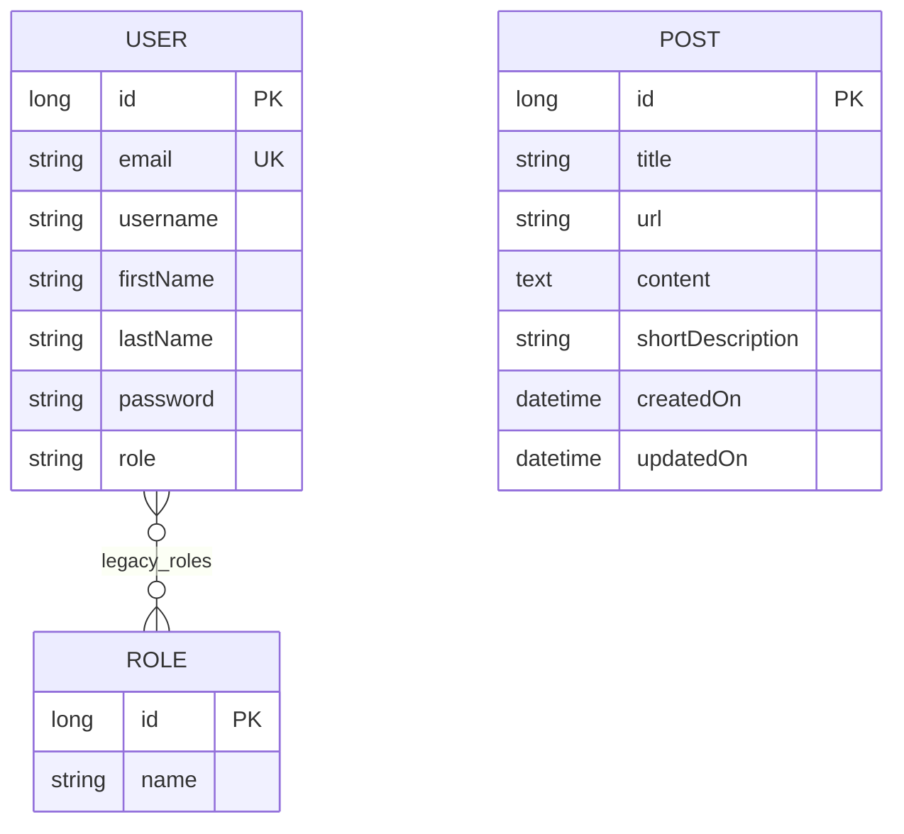

# Architecture — Thymeleaf Content Starter

## System scope

The application is a modular monolith: Spring MVC renders HTML on the server, Thymeleaf supplies templates, Bootstrap and jQuery support presentation, and Spring Data JPA stores content and account records in MySQL. H2 exists only for automated tests.

Two MVC routes are implemented: `/admin/index` and `/admin/posts`. JWT services and a bearer filter are present, but no HTTP login or token-issuance route exists. The project does not implement a complete article CRUD workflow or transactional charity features.

## Runtime structure

Static resources are served from the classpath at `/css`, `/js`, `/images`, and `/fonts`. Thymeleaf links resolve from the application context rather than relative to `/admin`.

## Module responsibilities

| Module | Responsibility |
| --- | --- |
| `ThymeleafApplication` | Bootstrap and component scanning |
| `HomeController` | Home view route and model attribute |
| `PostController` | Article-list route and `posts` model attribute |
| `PostServiceImpl` | Read-only repository query and DTO conversion |
| `PostMapper` | Explicit entity / DTO field mapping |
| `PostRepository` | Article persistence and URL lookup |
| `UserRepository` | Account lookup by email or username |
| `CustomUserDetailsService` | Email-based account loading and enum authority |
| `SecurityConfig` | Public resource policy, stateless sessions, authentication provider |
| `JwtService` | Signed JWT generation and claim verification |
| `JwtAuthenticationFilter` | Bearer parsing, account lookup, security context |
| `CustomAccessDeniedHandler` | Structured JSON `403` response |

## Data model

Posts are independent of users: no author or ownership relationship is implemented. All articles are returned without pagination or explicit sorting. Titles and content are non-null; URL is not unique. Hibernate fills timestamps on insert/update.

A user has a string enum role (`ROLE_USER` or `ROLE_ADMIN`) used by authentication. A separate `users_roles` join table remains from the original model, but its `Role` entities do not contribute granted authorities. User passwords must be stored as BCrypt hashes for the configured authentication provider; no registration controller enforces this because none exists.

## Article-list lifecycle

1. A browser requests `/admin/posts`; the current policy permits anonymous access.
2. `PostController` asks `PostService` for all articles.
3. `PostServiceImpl` executes a read-only transaction and maps entities to DTOs.
4. The controller adds the DTO list to the model.
5. Thymeleaf renders an empty state or a table. `th:text` escapes title and summary content.

The page intentionally does not render article content as raw HTML. Images, fonts, scripts, and styles are separate public resources.

## JWT authentication lifecycle

- Requests without a bearer header continue to the authorization policy.
- The filter verifies signed JWT claims, extracts an email subject, and loads that account.
- Validation requires matching identity and an unexpired expiration claim.
- Authorities come from the current database record, not the JWT role claim.
- Valid credentials populate the request's security context.
- Expired, malformed, or deleted-account tokens return `401` without continuing the chain.
- Exceptions from downstream application handlers are allowed to propagate; they are not mislabeled as JWT authentication errors.

A configured Base64 key survives application restarts. Without one, the process generates an ephemeral HS256 key. JWTs expire after 24 hours by default. No token revocation, refresh, logout endpoint, or email verification is implemented.

## Security policy

`/admin/**` and static assets are public to preserve the original demonstration behavior. The name `admin` does not imply role enforcement. Other paths require authentication. Method security is enabled, but no role-protected methods are currently declared. Stateless session handling and disabled CSRF fit the existing bearer setup; they do not provide a completed browser login experience.

The access-denied handler contains sample messages for user/product paths, which have no corresponding controllers in this project. Those messages are infrastructure examples, not implemented product features.

## Profiles and schema management

| Profile | Database | Schema policy |
| --- | --- | --- |
| Default | Environment-configured MySQL | `validate` by default |
| `local` | Environment-configured MySQL | `update` for development |
| `test` | In-memory H2 in MySQL mode | `create-drop` |

Tests never connect to the configured development MySQL database. H2 runs with `NON_KEYWORDS=USER` because the existing account table is named `user`.

The role mapping change from ordinals to enum names requires migration for preexisting schemas. Hibernate `update` is not a data migration strategy. Add versioned migrations before deployment and reconcile the two role representations deliberately.

## Verification and future development

Unit tests exercise mapper round trips, service behavior, identity lookup, JWT signing and verification, and filter error boundaries. Repository tests exercise real persistence and validation. MockMvc integration tests exercise the real Spring context, security policy, template rendering, escaping, and static-resource access. JaCoCo records coverage during Maven verification.

No MySQL-container integration, browser end-to-end, load, donation/payment, contact form, or deployment verification is claimed. Future features should introduce explicit authentication routes, protected administrative operations, article validation at write boundaries, pagination, schema migrations, and a coherent role model.

See [TESTING.md](TESTING.md) for measured results.
